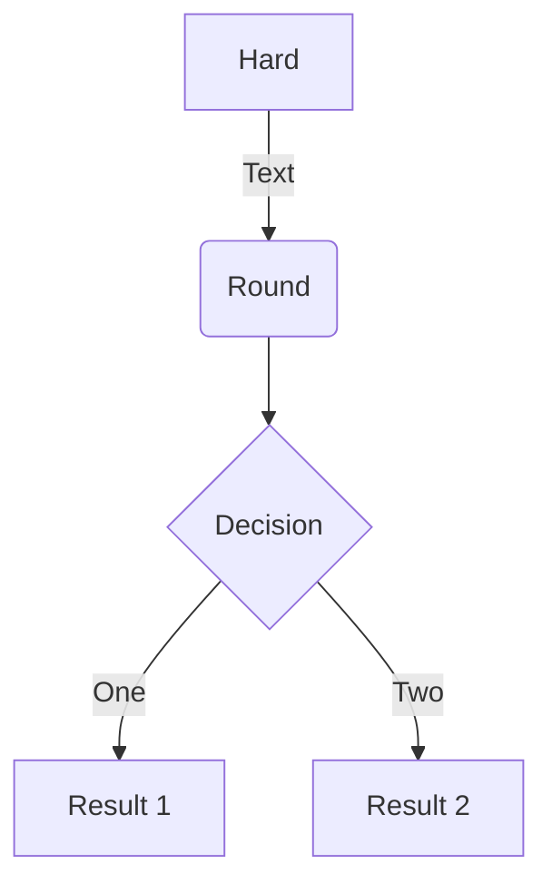

## Get started

There are two main ways to get started with Doks:

### Tutorial



Step-by-step instructions on how to start a new Doks project. [Tutorial →](https://getdoks.org/tutorial/introduction/)

### Quick Start



One page summary of how to start a new Doks project. [Quick Start →]()

## Go further

Recipes, Reference Guides, Extensions, and Showcase.

### Recipes

Get instructions on how to accomplish common tasks with Doks. [Recipes →](https://getdoks.org/tutorials/recipes/project-configuration/)

### Reference Guides

Learn how to customize Doks to fully make it your own. [Reference Guides →](https://getdoks.org/tutorials/reference-guides/security/)

### Extensions

Get instructions on how to add even more to Doks. [Extensions →](https://getdoks.org/tutorials/extensions/breadcrumb-navigation/)

### Showcase

See what others have build with Doks. [Showcase →](https://getdoks.org/showcase/electric-blocks/)

## Contributing

Find out how to contribute to Doks. [Contributing →](https://getdoks.org/tutorials/contributing/how-to-contribute/)

## Help

Get help on Doks. [Help →]()


graph TD
  A[Hard] -->|Check if condition true| B(Round)
  B --> C{Decision}
  C -->|One| D[Result 1]
  C -->|Two| E[Result 2]


